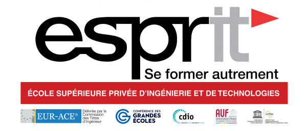

## Espritchatbot V1.1
This is a chatbot designed to answer questions about Esprit University. It was created by a group of Esprit's Students called INNOVISION using the [Rasa](https://rasa.com/) framework.

The unindexed intents are generated using the [RWKV-4-Raven](https://github.com/BlinkDL/RWKV-LM) 

## Prerequirments
Python 3.4+
Virtualenv
pip

## Installation
To open the chatbot, clone the repository to your local machine:

```
git clone https://github.com/karim-aloulou/Espritchatbot.git
```
All of the following will be built into a virtualenv

open the cmd in the root folder
do : 
```
cd ../

```

Then do the follow:

```
python -m venv myenv
```

Then activate the environnement

windows : 
```
myenv\Scripts\activate
```


linux : 
```
source myenv/bin/activate
```
Make sure you have Python 3.x installed on your machine. You can install the required Python libraries by running:

```
pip install -r requirements.txt

```

open the actions folder and drop the [RWKV-4-Raven-7B-V10 model](https://cdn-lfs.huggingface.co/repos/41/55/4155c7aaff64e0f4b926df1a8fff201f8ee3653c39ba67b31e4973ae97828633/5c50ad861a16267ec45853bad106b6f6975c49f66e27fe2b01d555834be88492?response-content-disposition=attachment%3B+filename*%3DUTF-8%27%27RWKV-4-Raven-7B-v10-Eng99%2525-Other1%2525-20230418-ctx8192.pth%3B+filename%3D%22RWKV-4-Raven-7B-v10-Eng99%25-Other1%25-20230418-ctx8192.pth%22%3B&Expires=1682535932&Policy=eyJTdGF0ZW1lbnQiOlt7IlJlc291cmNlIjoiaHR0cHM6Ly9jZG4tbGZzLmh1Z2dpbmdmYWNlLmNvL3JlcG9zLzQxLzU1LzQxNTVjN2FhZmY2NGUwZjRiOTI2ZGYxYThmZmYyMDFmOGVlMzY1M2MzOWJhNjdiMzFlNDk3M2FlOTc4Mjg2MzMvNWM1MGFkODYxYTE2MjY3ZWM0NTg1M2JhZDEwNmI2ZjY5NzVjNDlmNjZlMjdmZTJiMDFkNTU1ODM0YmU4ODQ5Mj9yZXNwb25zZS1jb250ZW50LWRpc3Bvc2l0aW9uPSoiLCJDb25kaXRpb24iOnsiRGF0ZUxlc3NUaGFuIjp7IkFXUzpFcG9jaFRpbWUiOjE2ODI1MzU5MzJ9fX1dfQ__&Signature=BD4PrRn6wRLcbqCG4gOpsygpna~nDeCTxn8WjDGHn30sidsC6T59AkmX6U3hPlQgBQchOoPLn5WThOp-6-t2yk1SlFnlf6Q1YXIn5BDH6-vcgvAQJ-DU2nxjJO3E92WxwGsE1LjRZ39Pn~ma-VXjLwdij0WsdNAyNEcOvjVumhfVAJgZOsRvTM4Q0IqCfVLHgK1dSOYr9AG5YtbuPZWJrMWRf3Xr5MFWj4BNn8-1G-B~PlaO99I1YFPvL0RtrYnsdrFEvL~jViisgMLRnNYNudphOaI4d22xb~dKlNfTpRMIdT0ljpHjEPz74MJMFw77qWMkaVF1YppckkTxf0N7Lg__&Key-Pair-Id=KVTP0A1DKRTAX)

click on it to download

Here we used the V10 99% English 1% other 8192 ctx

you can download and use any other version found [HERE](https://huggingface.co/BlinkDL/rwkv-4-raven/tree/main)


## Usage
To use the chatbot, navigate to the Espritchatbot directory and run these following commands:

1- if you are using the chatbot for the first time you will need to train it :

```
rasa train
```

2- Run the chatbot :

```
rasa shell
```
3- You will need to  run the actions

Open another cmd access the root then run :
```
rasa run actions --port 5055
```
PS : choose the proper strategy for your own hardware configuration while loading the RWKV model in the actions.py file

Here we tested it with cuda fp16i8 *20+ 

you can see other options [HERE](https://github.com/BlinkDL/ChatRWKV/blob/main/ChatRWKV-strategy.png)

RWKV python implementation can be found [HERE](https://pypi.org/project/rwkv/)

Hyperparameters of RWKV can be found in the actions.py file

4- Run the chatbot with nlu accuracy:

```
rasa shell nlu
```


## Credits

 Credits for the RWKV-4-Raven model goes to [BlinkDL](RWKV-4-Raven)

 Credits for Rasa project structure and implementation goes to INNOVISION
 
 INNOVISION Team Members: 
 - Med Karim Akkari
 - Nadia Bedhiafi
 - Sarra Gharsallah
 - Karim Aloulou
 - Yosr Abbassi
 - Med Hedi Souissi
 - Aziz Jebabli
